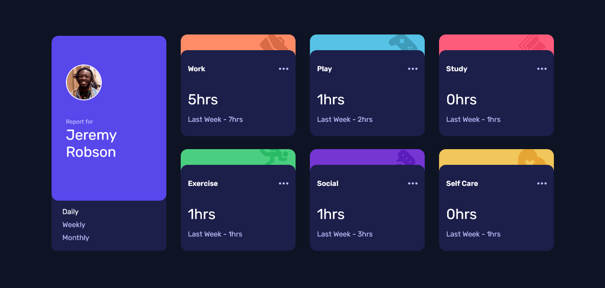

# Frontend Mentor - Time tracking dashboard solution

This is a solution to the [Time tracking dashboard challenge on Frontend Mentor](https://www.frontendmentor.io/challenges/time-tracking-dashboard-UIQ7167Jw). Frontend Mentor challenges help you improve your coding skills by building realistic projects. 

### Screenshot

### Links

- Solution URL:[https://github.com/nelsonleone/time-tracking-dashboard.git]
- Live Site URL:[https://tangerine-daifuku-571033.netlify.app/]

### Built with

- Semantic HTML5 markup
- CSS custom properties
- Flexbox
- CSS Grid
- Mobile-first workflow
- Vanilla Javascript

## Author

- Frontend Mentor - (https://www.frontendmentor.io/profile/nelsonleone)
- Twitter - (https://twitter.com/nelsonleone9678)

